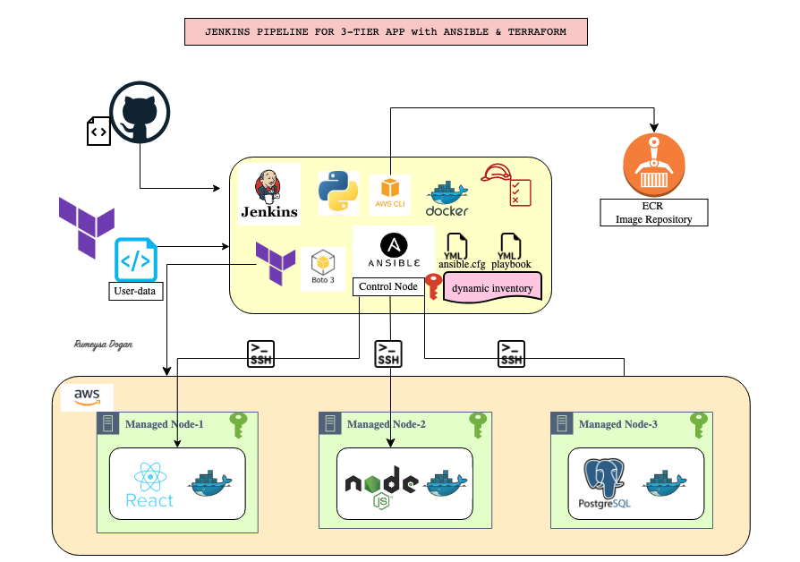
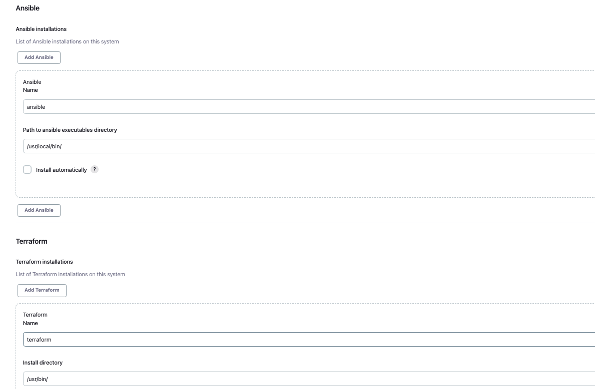
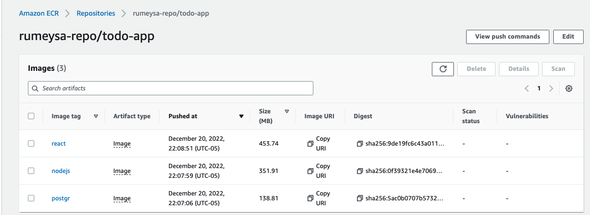

# Create Jenkins EC2 on AWS using Terraform | Run Jenkins Pipeline using Jenkinsfile
[Watch Jenkins شرح on YouTube by the intsructor Marwan abdelazez](https://www.youtube.com/watch?v=bLtWzR6oEPs&list=PLUfL_MDLHAQa9cc67hFELLU1nJehIYXPM&pp=iAQB)

[Watch Terraform_Part1 شرح on YouTube](https://youtu.be/zF_N4flz8lw)

[Watch Terraform_Part2 شرح on YouTube](https://youtu.be/V6CPs_C9v8A)

<h1 align="center"> Hi 👋, I'm Yousef Diab </h1>
<h3 align="center"> Full Stack & Devops engineer  </h3>

<a href="https://git.io/typing-svg"></a>


## Step 1:
### Build AWS EC2 Instance
```
cd Terraform-Ubuntu-EC2/

terraform init

terraform plan

terraform apply
```
---
## Step 2:
### Install Jenkins and other dependencies
```bash
# SSH to the EC2 using the keypair, Create sh file with the commands as shown in the install.sh file 
vim install.sh
chmod +x install.sh 
./install.sh
```
## Step 3:
### Setup Jenkins
```bash
# Access Jenkins using the EC2 IPv4-Public-DNS:8080
```
---

## Step 4:
### Add Github and Dockerhub credentials in Jenkins
`Manage Jenkins > Manage Credentials > Global > Add Credentials`

Make sure to use Dockerhub access token instaed of the password
`Dockerhub > Account Settings > Security > New Access Token`

---
## Step 5: 
### Create Jenkins Pipeline 
`Choose pipeline, if not found you can install it from Manage Jenkins > Manage Plugins`

In **Pipeline Section** in the end of the page choose **Pipeline script from SCM** > Add **Gihub Repository link** > Using **Github Credentials**

`Make usre you choose the right branch and the right path of the Jenkinsfile`

---


Wordsmith is the demo project originally shown at DockerCon EU 2017 and 2018.

The demo app runs across three containers:

- **[api](api/Dockerfile)** - a Java REST API which serves words read from the database
- **[web](web/Dockerfile)** - a Go web application that calls the API and builds words into sentences
- **db** - a Postgres database that stores words

## Architecture


## Build and run in Docker Compose

The only requirement to build and run the app from source is Docker. Clone this repo and use Docker Compose to build all the images. You can use the new V2 Compose with `docker compose` or the classic `docker-compose` CLI:

```shell
docker compose up --build
```

Or you can pull pre-built images from Docker Hub using `docker compose pull`.


## Deploy using Kubernetes manifests

You can deploy the same app to Kubernetes using the [Kustomize configuration](./kustomization.yaml). It will define all of the necessary Deployment and Service objects and a ConfigMap to provide the database schema.

Apply the manifest using `kubectl` while at the root of the project:

```shell
kubectl apply -k .
```

Once the pods are running, browse to http://localhost:8080 and you will see the site.

Docker Desktop includes Kubernetes and the [kubectl](https://kubernetes.io/docs/reference/kubectl/overview/) command line, so you can work directly with the cluster. Check the services are up, and you should see output like this:

```text
kubectl get svc
NAME         TYPE           CLUSTER-IP       EXTERNAL-IP   PORT(S)          AGE
db           ClusterIP      None             <none>        55555/TCP        2m
kubernetes   ClusterIP      10.96.0.1        <none>        443/TCP          38d
web          LoadBalancer   10.107.215.211   <pending>     8080:30220/TCP   2m
words        ClusterIP      None             <none>        55555/TCP        2m
```

Check the pods are running and you should see one pod each for the database and web components and five pods for the words API:

```text
kubectl get pods
NAME                   READY     STATUS    RESTARTS   AGE
db-8678676c79-h2d99    1/1       Running   0          1m
web-5d6bfbbd8b-6zbl8   1/1       Running   0          1m
api-858f6678-6c8kk     1/1       Running   0          1m
api-858f6678-7bqbv     1/1       Running   0          1m
api-858f6678-fjdws     1/1       Running   0          1m
api-858f6678-rrr8c     1/1       Running   0          1m
api-858f6678-x9zqh     1/1       Running   0          1m
```
----------------------------

# Project-18: Jenkins Pipeline for 3-Tier App with Ansible & Docker



## Pre-requisites

* Terraform installed locally
* AWS account and keypair created in AWS
* Preferred IDE (I will use VS Code)
* AWS region: `us-east-1`

### Step-1: Install Jenkins server with Terraform

We will install Jenkins server using Terraform and bootstrap with userdata script to install docker, ansible, docker-compose, python-boto3, awscli2. You need to have a key-pair ready to run the Terraform file. If you have one, update it in `variables.tf` or create a new key on AWS Console and update variables file with the key name. AMI used is `latest AmazonLinux-2` in `us-east-1` region

From `jenkins_server` directory we will run below commands:
```sh
terraform init
terraform plan
terraform apply
```


### Step-2: Create a GitHub repository

We will create a private repository in GitHub to store source code files.


Then to be able to access this repo from Jenkins, we will create an access token from GitHub.

Go to your GitHub avatar, click `settings` -> `Developer Settings` -> `Personal Access Tokens` -> Create new token and copy it to somewhere.We will need this token later.


### Step-3: Clone repo to Jenkins server

We will SSH into jenkins server, I will use VS Code Remote SSH plugin to connect Jenkins. Once we are connected, we will clone our newly created repo to this server by using TOKEN we have just created.  
```sh
git clone https://<replace_with_your_token>@https://github.com/rumeysakdogan/rd-todo-app.git
```

Next we will copy `nodejs`, `react` and `postgresql` folders given under `todo-app` directory to our repo. Since I am using remote SSH extension, I will drag/drop the files to my VS Code.You can copy the files under `todo-app` in your local and push it to GitHub as well.

### Step-4: Create docker files for `Nodejs`, `Postgres` and `React`

#### Dockerfile for Postgres

Create a `dockerfile-postgresql` with below content under `postgresql` directory.

```sh
FROM postgres
COPY ./postgresql/init.sql /docker-entrypoint-initdb.d/
EXPOSE 5432
```

#### Dockerfile for React

Create a `dockerfile-react` with below content under `react` directory.
```sh
FROM node:14
# Create app directory
WORKDIR /app
COPY ./react/client/package*.json ./
RUN yarn install
# copy all files into the image
COPY ./react/client/ .
EXPOSE 3000
CMD ["yarn", "run", "start"]
```

#### Dockerfile for Nodejs

Create a `dockerfile-nodejs` with below content under `nodejs` directory.
```sh
FROM node:14
# Create app directory
WORKDIR /usr/src/app
COPY ./nodejs/server/package*.json ./
RUN npm install
# If you are building your code for production
# RUN npm ci --only=production

# copy all files into the image
COPY ./nodejs/server/ .
EXPOSE 5000
CMD ["node","app.js"]
```

### Step-5: Create Ansible config and Dynamic Inventory file

We will create `ansible.cfg` file under our repository.
```sh
[defaults]
host_key_checking=False
inventory=inventory_aws_ec2.yml
deprecation_warnings=False
interpreter_python=auto_silent
remote_user=ec2-user
```

We will also create a dynamic inventory file in our repository. Jenkins will create our application servers with terraform, aws will identify those servers with the given tags and add to our dynamic inventory.

```sh
plugin: aws_ec2
regions:
  - "us-east-1"
filters:
  tag:stack: ansible_project
keyed_groups:
  - key: tags.Name
  - key: tags.environment
compose:
  ansible_host: public_ip_address
```

### Step-6: Create Terraform file to create 3 nodes for each each tier of application

We will create 3 servers with Jenkins using the terraform we have installed while provisioning Jenkins server. Create `main.tf` with the content given under `todo-app` folder.
```sh
terraform {
  required_providers {
    aws = {
      source  = "hashicorp/aws"
      version = "~> 4.0"
    }
  }
}

provider "aws" {
  region = "us-east-1"
}

variable "tags" {
  default = ["postgresql", "nodejs", "react"]
}

resource "aws_instance" "managed_nodes" {
  ami = "ami-0176fddd9698c4c3a" #RHEL 9 with HA
  count = 3
  instance_type = "t2.micro"
  key_name = "FirstKey"  #replace with your key name
  vpc_security_group_ids = [aws_security_group.tf-sec-gr.id]
  iam_instance_profile = "jenkins-project18-profile" #same profile used in jenkins server creation
  tags = {
    Name = "ansible_${element(var.tags, count.index )}"
    stack = "ansible_project"
    environment = "development"
  }
}

resource "aws_security_group" "tf-sec-gr" {
  name = "appSecGrp"
  tags = {
    Name = "appSecGrp"
  }

  ingress {
    from_port   = 22
    protocol    = "tcp"
    to_port     = 22
    cidr_blocks = ["0.0.0.0/0"]
  }
  ingress {
    from_port   = 5000
    protocol    = "tcp"
    to_port     = 5000
    cidr_blocks = ["0.0.0.0/0"]
  }
  ingress {
    from_port   = 3000
    protocol    = "tcp"
    to_port     = 3000
    cidr_blocks = ["0.0.0.0/0"]
  }
  ingress {
    from_port   = 5432
    protocol    = "tcp"
    to_port     = 5432
    cidr_blocks = ["0.0.0.0/0"]
  }

  egress {
    from_port   = 0
    protocol    = -1
    to_port     = 0
    cidr_blocks = ["0.0.0.0/0"]
  }
}

output "react_ip" {
  value = "http://${aws_instance.managed_nodes[2].public_ip}:3000"
}

output "node_public_ip" {
  value = aws_instance.managed_nodes[1].public_ip

}

output "postgre_private_ip" {
  value = aws_instance.managed_nodes[0].private_ip

}
```

### Step-7: Create docker_project.yml for Ansible

We will create a playbook `docker_project.yml` to configure 3 app servers with Ansible.
```sh
- name: install docker and config
  hosts: _development
  become: true
  vars:
    aws_region: us-east-1
    ecr_registry: <your_AWS_account_number>.dkr.ecr.us-east-1.amazonaws.com  # can be found in AWS as Account ID: XXXX-XXXX-XXXX
  tasks:
    - name: update all packages
      yum:
        name: '*'
        state: latest

    # we may need to uninstall any existing docker files from the centos repo first.
    - name: Remove docker if installed from CentOS repo
      yum:
        name: "{{ item }}"
        state: removed
      with_items:
        - docker
        - docker-client
        - docker-client-latest
        - docker-common
        - docker-latest
        - docker-latest-logrotate
        - docker-logrotate
        - docker-engine

    - name: Install yum utils
      yum:
        name: "{{ item }}"
        state: latest
      with_items:
        - yum-utils
        - device-mapper-persistent-data
        - lvm2
        - unzip

    - name: Add Docker repo
      get_url:
        url: https://download.docker.com/linux/centos/docker-ce.repo
        dest: /etc/yum.repos.d/docer-ce.repo

    - name: Install Docker
      package:
        name: docker-ce
        state: latest

    - name: Install pip
      package:
        name: python3-pip
        state: present
        update_cache: true

    - name: Install docker sdk
      pip:
        name: docker

    - name: Add user ec2-user to docker group
      user:
        name: ec2-user
        groups: docker
        append: yes

    - name: Start Docker service
      service:
        name: docker
        state: started
        enabled: yes

    - name: install aws cli
      get_url:
        url: https://awscli.amazonaws.com/awscli-exe-linux-x86_64.zip
        dest: /home/ec2-user/awscliv2.zip

    - name: unzip zip file
      unarchive:
        src: /home/ec2-user/awscliv2.zip
        dest: /home/ec2-user
        remote_src: True

    - name: run the awscli
      shell: ./aws/install

    - name: log in to AWS ec2-user
      shell: |
        export PATH=/usr/local/bin:$PATH
        source ~/.bash_profile
        aws ecr get-login-password --region {{ aws_region }} | docker login --username AWS --password-stdin {{ ecr_registry }}

- name: postgre database config
  hosts: _ansible_postgresql
  become: true
  vars:
    postgre_container: /home/ec2-user/postgresql
    container_name: rumeysa_postgre
    image_name: <your_AWS_account_number>.dkr.ecr.us-east-1.amazonaws.com/rumeysa-repo/todo-app:postgr
  tasks:
    - name: remove {{ container_name }} container and {{ image_name }} if exists
      shell: "docker ps -q --filter 'name={{ container_name }}' && docker stop {{ container_name }} && docker rm -fv {{ container_name }} && docker image rm -f {{ image_name }} || echo 'Not Found'"

    - name: Launch postgresql docker container
      docker_container:
        name: "{{ container_name }}"
        image: "{{ image_name }}"
        state: started
        ports:
          - "5432:5432"
        env:
          POSTGRES_PASSWORD: "Pp123456789"
        volumes:
          - /db-data:/var/lib/postgresql/data

- name: Nodejs Server configuration
  hosts: _ansible_nodejs
  become: true
  vars:
    container_path: /home/ec2-user/nodejs
    container_name: rumeysa_nodejs
    image_name: <your_AWS_account_number>.dkr.ecr.us-east-1.amazonaws.com/rumeysa-repo/todo-app:nodejs
  tasks:
    - name: remove {{ container_name }} container and {{ image_name }} if exists
      shell: "docker ps -q --filter 'name={{ container_name }}' && docker stop {{ container_name }} && docker rm -fv {{ container_name }} && docker image rm -f {{ image_name }} || echo 'Not Found'"

    - name: Launch postgresql docker container
      docker_container:
        name: "{{ container_name }}"
        image: "{{ image_name }}"
        state: started
        ports:
          - "5000:5000"

- name: React UI Server configuration
  hosts: _ansible_react
  become: true
  vars:
    container_path: /home/ec2-user/react
    container_name: rumeysa_react
    image_name: <your_AWS_account_number>.dkr.ecr.us-east-1.amazonaws.com/rumeysa-repo/todo-app:react
  tasks:
    - name: remove {{ container_name }} container and {{ image_name }} image if exists
      shell: "docker ps -q --filter 'name={{ container_name }}' && docker stop {{ container_name }} && docker rm -fv {{ container_name }} && docker image rm -f {{ image_name }} || echo 'Not Found'"

    - name: Launch react docker container
      docker_container:
        name: "{{ container_name }}"
        image: "{{ image_name }}"
        state: started
        ports:
          - "3000:3000"
```

### Step-8: Create templates for nodejs and react

We will create `node-env-template` under repository which will be used by Jenkins and `DB_HOST` will be replaced after Jenkins created Postgre server with Terraform.
```sh
SERVER_PORT=5000
DB_USER=postgres
DB_PASSWORD=Pp123456789
DB_NAME=rumeysatodo
DB_HOST=${DB_HOST}
DB_PORT=5432
```

We will create `react-env-template` under repository which will be used by Jenkins.
```sh
REACT_APP_BASE_URL=http://${NODE_IP}:5000/
```

### Step-9: Configure Jenkins server

Connect to the jenkins server `http://<jenkins-server public ip>:8080`.

Connect Jenkins server with SSH and take the initial password with the following commands:

```bash
ssh -i FirstKey.pem ec2-user@<jenkins server public ip>
sudo cat /var/lib/jenkins/secrets/initialAdminPassword
```

Use initial password in `http://<jenkins-server public ip>:8080`

Configure `jenkins server`. (create user > install suggested plugins > start jenkins)

Learn Ansible and  Terraform's executable path from the instance. We use them in jenkins plugins.

```bash
which ansible         # output: /usr/local/bin/ansible
which terraform       # output: /usr/bin/terraform
```
Go to the `http://<jenkins-server public ip>:8080`.

Add the `Ansible` and `Terraform` plugins. 
  

Follow these steps `manage jenkins - manage plugins - add ansible and terraform plugins (locale plugin if it is necessary) - global tool configuration`.

)

### Step-10: Add credentials to Jenkins

We will go to the `Manage Jenkins` --> `Manage credentials`
and add github token first.
```sh
Type: username with password
username: ec2-user
password: paste your TOKEN
ID: github-token
Description: github-token
```

Similarly we will add our private key that we use to create Jenkins server as Global credentials.
```sh
Type: SSH key with username
ID: ansible-key # same id will be used in Jenkinsfile
Description: ansible-key
user: ec2-user
Private Key: <Paste content of your PEM file downloaded locally after creating a keypair in AWS>
```

### Step-11: Create Jenkinsfile under repo

We will create a Jenkinsfile now with the content given under `todo-app` folder which will deploy our application by using Terraform and Ansible.

We can commit/push all files we have created under our repository now.

### Step-12: Create Pipeline Job in Jenkins

Create pipeline job in Jenkins with below properties.

```sh
Name: todo-app-pipeline
Kind: pipeline
GitHub project: <url_of_your_todo_app_repo>
Pipeline: Pipeline script from SCM
SCM: Git
Repo URL: <url_of_your_todo_app_repo>
Credentials: github-token
Branch: */main
Path: Jenkinsfile
```

### Step-13: Build job and test application from browser

It is time to test our pipeline. Click `Build Job`.We can check resources from AWS Console. Our nodes for 3-tier of application is created.


ECR repository is created, Docker images created and pushed to ECR repo.



Now we can test our application from browser. Get public IP of react server and type `http://<public_IP_of_react_server>:3000`


We can also check our nodejs server which is used as backend. Check `http://<public_IP_of_nodejs_server>:5000/todos` from browser.


Our application is running successfully, we will go to Jenkins and click `Proceed` to destroy the resources we have created.


### Step-14: Destroy your Jenkins server

We will run below command from our local where we have installed `Jenkins server`.
```sh
terraform destroy -auto-approve
```


